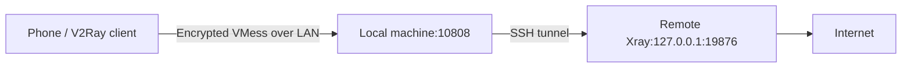

# ssh2v2ray

Expose a V2Ray-compatible endpoint through SSH. VMess carries TCP and UDP traffic inside the SSH TCP tunnel.



## Setup

1. Install OpenSSH on the local machine and [Xray](https://github.com/XTLS/Xray-core/releases) on the remote host. SSH must allow TCP forwarding. Generate a fresh UUID with `xray uuid`.

2. Copy `server.example.json` to `server.json`, replace `REPLACE_WITH_UUID` with the generated UUID, and upload it to the remote host.

3. Start Xray remotely and keep it running:

   ```sh
   xray run -config server.json
   ```

4. On the local machine, replace `LOCAL_LAN_IP`, `SSH_PORT`, and `USER@HOST`, then keep this command running:

   ```sh
   ssh -N -T -p SSH_PORT -o ExitOnForwardFailure=yes -o ServerAliveInterval=15 -o ServerAliveCountMax=3 -L LOCAL_LAN_IP:10808:127.0.0.1:19876 USER@HOST
   ```

5. Connect the phone to the same LAN. In v2rayNG add **VMess** with address `LOCAL_LAN_IP`, port `10808`, the same UUID, alterId `0`, encryption `auto`, transport `tcp`, and TLS off. Select **VPN mode**, **Global** routing, and disable per-app exclusions. Connect and check that your public IP matches the remote host's exit IP.

## Optional services and checks

- Linux/systemd: edit `ssh2v2ray-tunnel.service` placeholders and key path, configure SSH key authentication, and verify the host key with an interactive SSH connection. Put the remote configuration at `~/.local/share/ssh2v2ray/server.json`. Install each service in `~/.config/systemd/user/` on its respective host, adjusting executable paths if needed. Run `systemctl --user daemon-reload`, then `systemctl --user enable --now ssh2v2ray-tunnel` locally and `systemctl --user enable --now ssh2v2ray-server` remotely. Stop the foreground commands first to free their ports. User services normally start at login.
- Verification: copy `test-client.example.json` to `test-client.json`, replace the LAN address and UUID, and run `xray run -config test-client.json`. In another terminal run `python3 check-udp.py` and `curl --socks5-hostname 127.0.0.1:10809 https://api.ipify.org`. Stop the test client afterward.

## Notes

- Requires a remote host that can run Xray; SSH credentials alone are insufficient. No root access or extra public server port is needed.
- OpenSSH/Xray can run on Linux, macOS, and Windows; only Linux-to-Linux was tested. Keep both hosts awake and clocks synchronized.
- Allow local TCP port `10808` through the firewall, disable Wi-Fi client isolation, and use a stable LAN address. Use `127.0.0.1` instead for a client on the local machine.
- These foreground commands stop when terminated; use your OS's service manager for automatic startup/reconnection.
- VMess works with tested Xray versions 26.3.27/26.7.28, but is deprecated there. Keep real configurations, UUIDs, keys, and passwords private.

References: [SSH forwarding](https://man.openbsd.org/ssh), [VMess](https://xtls.github.io/en/config/inbounds/vmess.html).
