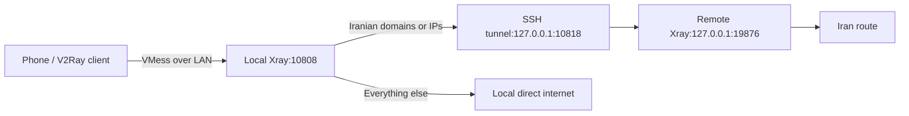

# ssh2v2ray

Route Iranian sites through an SSH-connected exit and everything else through the local machine's direct internet. Routing happens on the local machine; the phone sends all traffic to it. Assumes the SSH host provides the desired Iran route.



## Setup

1. Install [Xray](https://github.com/XTLS/Xray-core/releases) on both machines and OpenSSH locally. The remote SSH server must permit TCP forwarding. Generate a fresh UUID with `xray uuid`.
2. Copy `server.example.json` to `server.json`, replace `REPLACE_WITH_UUID`, upload it to the SSH host, and run there:

   ```sh
   xray run -config server.json
   ```

3. Locally, copy `router.example.json` to `router.json`; replace `LOCAL_LAN_IP` and both `REPLACE_WITH_UUID` values with the same UUID. Download the routing databases into that directory:

   ```sh
   curl -fL https://github.com/v2fly/domain-list-community/releases/latest/download/dlc.dat -o geosite.dat
   curl -fL https://github.com/v2fly/geoip/releases/latest/download/geoip.dat -o geoip.dat
   ```

4. Start the local SSH tunnel, replacing `SSH_PORT` and `USER@HOST`:

   ```sh
   ssh -N -T -p SSH_PORT -o ExitOnForwardFailure=yes -o ServerAliveInterval=15 -o ServerAliveCountMax=3 -L 127.0.0.1:10818:127.0.0.1:19876 USER@HOST
   ```

5. In another local terminal, from the config directory:

   ```sh
   XRAY_LOCATION_ASSET="$PWD" xray run -config router.json
   ```

6. On the same LAN, add VMess in v2rayNG: address `LOCAL_LAN_IP`, port `10808`, the same UUID, alterId `0`, encryption `auto`, transport `tcp`, TLS off. Keep **VPN mode**, **Global** routing, and no per-app exclusions. No phone-side geo rules are needed.

## Services and checks

- Linux/systemd: edit paths and SSH placeholders in the service templates. Configure SSH key authentication and verify the host key interactively. Put each host's config in `~/.local/share/ssh2v2ray/`, with the geo databases on the local host. Install the corresponding services in `~/.config/systemd/user/` and run `systemctl --user daemon-reload`. Enable `ssh2v2ray-server` remotely and `ssh2v2ray-tunnel` plus `ssh2v2ray-router` locally with `systemctl --user enable --now SERVICE_NAME`. Stop foreground processes first. User services normally start at login.
- Verification: fill in `test-client.example.json`, save as `test-client.json`, and run `xray run -config test-client.json`. In another terminal run `curl --socks5-hostname 127.0.0.1:10809 https://api.ipify.org` (should show the local internet exit) and `python3 check-udp.py` (checks direct UDP DNS). Request a known Iranian site through the same SOCKS endpoint and inspect the local router logs for `iran`; other traffic should show `direct`. Stop the test client afterward.

## Notes

- `geosite:category-ir` matches Iranian domains; `geoip:ir` matches Iranian addresses. `IPOnDemand` resolves unmatched domains for IP matching; the first outbound is the direct default. Keep databases updated and add missing domains to the Iran rule. If SSH fails, Iran-matched traffic fails rather than falling back to direct.
- Keep both machines running, clocks synchronized, and the LAN IP stable. Allow local TCP port `10808`; Wi-Fi client isolation must be off. No extra public proxy port or root access is required.
- Only Linux-to-Linux was tested. OpenSSH/Xray support other platforms, but shell commands and service setup need adapting. VMess works with tested Xray versions 26.3.27/26.7.28, but is deprecated there.
- Keep real configurations, UUIDs, keys, and passwords out of Git.

References: [SSH forwarding](https://man.openbsd.org/ssh), [Xray routing](https://xtls.github.io/en/config/routing.html).
